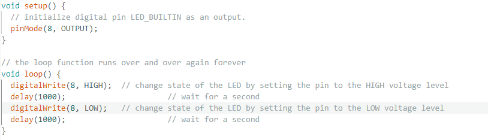
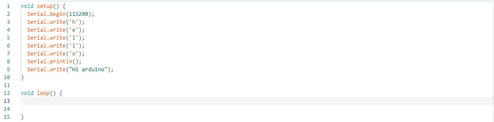
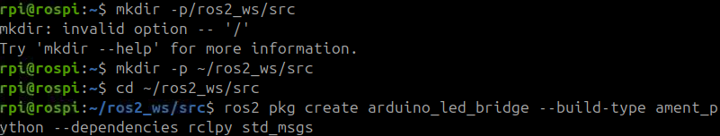

# iot-ROS2-2026
IoT개발자 과정 ROS 로봇 프로그래밍

## 1일차
- 다운로드 및 세팅
    - ROS2 jazzy 다운로드(라즈베리파이{VNC}, VM WARE) - [문서링크](https://docs.ros.org/en/jazzy/Installation/Ubuntu-Install-Debs.html)

- 라즈베리파이에 다운로드
    - 라즈베리 이메저를 통해 라즈베리파이 SD카드 초기화 및 재설치(우분투설치)
    - 가상모니터 VNC를 사용하기 위해 아래처럼 세팅
        ```text
        rpi@rospi
        1.  ip a
        2.  sudo apt update
        3.  sudo apt upgrade
        4.  ip a
        5.  ls
        6.  cd downloads
        7.  cd Downloads/
        8.  wget https://downloads.realvnc.com/file/vnc.files/VNC-server-7.16.0-Linux-ARM64.deb
        9.  wget https://downloads.realvnc.com/file/vnc.files/VNC-Server-7.16.0-Linux-ARM64.deb
        10.  wget https://downloads.realvnc.com/download/file/vnc.files/VNC-Server-7.16.0-Linux-ARM64.deb
        11.  ls
        12.  chmod u+x VNC-Server-7.16.0-Linux-ARM64.deb
        13.  sudo apt install ./VNC-Server-7.16.0-Linux-ARM64.deb
        14.  ls
        15.  sudo apt install
        16.  sudo apt install ./VNC-Server-7.16.0-Linux-ARM64.deb
        17.  clear
        18.  sudo nano /etc/nanorc
        19.  sudo nano /etc/gdm3/custom.conf
        20.  sudo apt install xserver-xorg-video-dummy xinit
        21.  ls /etc
        22.  cd ..

        23.  sudo nano /etc/X11/xorg.conf
            Section "Device"
                Identifier "Configured Video Device"
                Driver "dummy"
            EndSection
            
            Section "Monitor"
                Identifier "Configured Monitor"
                HorizSync 28-80
                VertRefresh 48-75
                Modeline "1920x1080" 172.80 1920 2040 2248 2576 1080 1081 1084 1118
            EndSection

            Section "Screen"
                Identifier "Default Screen"
                Device "Configured Video Device"
                Monitor "Configured Monitor"
                DefaultDepth 24
                SubSection "Display"
                        Depth 24
                        Modes "1920x1080"
                EndSubSection
            EndSection

        24.  sudo systemctl enable vncserver-x11-serviced.service
        25.  sudo systemctl start vncserver-x11-serviced.service
        26.  sudo systemctl status vncserver-x11-serviced.service

        27.  sudo nano /boot/firmware/config.txt
            hdmi_force_hotplug=1
            59 hdmi_group=2
            60 hdmi_mode=82

        28.  sudo reboot
        29.  sudo systemctl restart gdm3
        ```

## 2일차
- 우분투를 통한 ROS2 프로그래밍
- 기본 기능 써보기(TutleSim)
    ```text
    ros2 run turtlesim turtlesim_node  // 거북이 켜기
    ros2 run turtlesim turtle_teleop_key  // 거북이를 방향키로 움직일수있는 코드
    ```
- jupyter사용
    ```text
    1. sudo apt install python3.12-venv
       python3 -m venv --system-site-packages .venv
       source .venv/bin/activate
       python -m pip install --upgrade pip
       python -m pip install ipykernel
       pip3 install jupyter lab
       jupyter lab

    2. jupyter server --generate-config
       nano ~/.jupyter/jupyter_server_config.py

       파일 맨아래로 가서 다음과 같은 내용 추가
       c.ServerApp.ip = '0.0.0.0'
       c.ServerApp.port = 7890
       c.ServerApp.port_retries = 0
       c.ServerApp.open_browser = False

    3. python -m ipykernel install --user --name .venv --display-name "python(ros:jazzy)"
       ```

## 3일차
- VM WARE를 통한 우분투로 터틀심 가동
- 아두이노 활용(스케치 아두이노 IDE 2.3.8설치)
- 아두이노에서 LED 전구 불 켜보기
    

- 아두이노에서 문자 출력해보기
    

- 아두이노에서 문자 출력에 따라 LED를 키고 끄고 LED색변경 하는 기능 구현
    ```cpp
    int r = 8;
    int g = 9;
    int b = 10;

    bool on = false;
    char c = 'r';

    void setup() {
    pinMode(r, OUTPUT);
    pinMode(g, OUTPUT);
    pinMode(b, OUTPUT);
    
    Serial.begin(9600);
    off();
    Serial.println("Ready! Input o, x, r, g, b"); // 시작 메시지
    }

    void off() {
    // 3.3V 연결 방식이므로 HIGH를 주어야 불이 꺼짐
    digitalWrite(r, HIGH);
    digitalWrite(g, HIGH);
    digitalWrite(b, HIGH);
    }

    void set() {
    off();
    
    // 3.3V 연결 방식이므로 LOW를 주어야 불이 켜짐
    if (c == 'r') digitalWrite(r, LOW);
    if (c == 'g') digitalWrite(g, LOW);
    if (c == 'b') digitalWrite(b, LOW);
    }

    void loop() {
    if (Serial.available() > 0) {
        char d = Serial.read();
        
        // 엔터키(\n, \r) 무시
        if (d == '\n' || d == '\r') return;
        
        if (d == 'o') {
        on = true;
        set();
        Serial.println(">> ON"); // 화면에 확인 메시지 출력
        } 
        else if (d == 'x') {
        on = false;
        off();
        Serial.println(">> OFF");
        } 
        else if (d == 'r' || d == 'g' || d == 'b') {
        c = d;
        if (on) set();
        Serial.print(">> Color: ");
        Serial.println(c);
        }
    }
    }
    ```

## 4일차

### ROS 2 & Arduino 다중 LED (R, G, B) 제어 가이드
- 라즈베리파이에 아두이노 연결해서 라즈베리파이에 새로운 패키지 만들어주기
    

#### 1. 아두이노 회로 구성 및 코드 (`led_control.ino`)

##### 1-1. 회로 연결 (Active-High 방식 기준)
- **빨간색(R) LED**: 아두이노 8번 핀
- **초록색(G) LED**: 아두이노 9번 핀
- **파란색(B) LED**: 아두이노 10번 핀
- **공통선**: GND (그라운드)
> **💡 트러블슈팅 (색깔이 안 바뀔 때):** > 특정 명령을 내렸는데 색이 안 바뀌거나 이상한 색이 나온다면, LED의 긴 다리(+)가 8,9,10번에 꽂혀있고 짧은 다리(-)가 GND에 잘 꽂혀있는지 확인해 주세요!

##### 1-2. 아두이노 소스 코드
```cpp
// 변수 및 상수 선언
String cmd = "";
const int RED_LED = 8; 
const int GREEN_LED = 9; 
const int BLUE_LED = 10; 

void setup() {
  // 핀 모드 설정
  pinMode(RED_LED, OUTPUT);
  pinMode(GREEN_LED, OUTPUT);
  pinMode(BLUE_LED, OUTPUT);
  
  // 초기 상태: 모두 끄기 (LOW가 꺼짐, HIGH가 켜짐)
  digitalWrite(RED_LED, LOW);
  digitalWrite(GREEN_LED, LOW);
  digitalWrite(BLUE_LED, LOW);

  Serial.begin(115200);
}

void loop() {
  // 시리얼 데이터 수신 확인
  if(Serial.available() > 0) {
    cmd = Serial.readStringUntil('\n');
    cmd.trim(); // 공백 및 줄바꿈 제거

    // 수신된 명령에 따른 LED 개별 제어 로직
    if(cmd == "OFF") {
      digitalWrite(RED_LED, LOW);
      digitalWrite(GREEN_LED, LOW);
      digitalWrite(BLUE_LED, LOW);
      Serial.println("All LEDs OFF");
    }
    else if(cmd == "R") {
      digitalWrite(RED_LED, HIGH);   // 빨간불만 ON
      digitalWrite(GREEN_LED, LOW);
      digitalWrite(BLUE_LED, LOW);
      Serial.println("Red LED ON");
    }
    else if(cmd == "G") {
      digitalWrite(RED_LED, LOW);
      digitalWrite(GREEN_LED, HIGH); // 초록불만 ON
      digitalWrite(BLUE_LED, LOW);
      Serial.println("Green LED ON");
    }
    else if(cmd == "B") {
      digitalWrite(RED_LED, LOW);
      digitalWrite(GREEN_LED, LOW);
      digitalWrite(BLUE_LED, HIGH);  // 파란불만 ON
      Serial.println("Blue LED ON");
    }
  }
}
```

---

#### 2. ROS 2 파이썬 노드 작성 (`led_multi_subscriber.py`)

**경로**: `~/ros2_ws/src/arduino_led_bridge/arduino_led_bridge/led_multi_subscriber.py`

```python
import rclpy
from rclpy.node import Node
from std_msgs.msg import String
import serial
import time

class LedMultiSubscriber(Node):
    def __init__(self):
        super().__init__('led_multi_subscriber')

        # 시리얼 포트 설정 (라즈베리파이 환경)
        port = '/dev/ttyACM0'
        baudrate = 115200

        try:
            self.ser = serial.Serial(port, baudrate, timeout=1)
            time.sleep(2) # 연결 안정화 대기
            self.get_logger().info(f'Serial connected: {port}')
        except Exception as e:
            self.get_logger().error(f'Failed to open serial port: {e}')
            self.ser = None

        # 구독자(Subscriber) 설정: 'led_cmd' 토픽을 대기
        self.subscription = self.create_subscription(
            String,
            'led_cmd',
            self.listener_callback,
            10
        )

    def listener_callback(self, msg):
        if self.ser is None:
            self.get_logger().error('Serial not available')
            return

        # 입력받은 문자열을 정제하고 대문자로 변환 (r -> R)
        data = msg.data.strip().upper()
        
        # 아두이노가 읽을 수 있도록 개행문자(\n) 추가 후 바이트 전송
        command_to_send = data + '\n'
        self.ser.write(command_to_send.encode('utf-8'))
        
        self.get_logger().info(f'Sent to Arduino: {data}')

def main(args=None):
    rclpy.init(args=args)
    node = LedMultiSubscriber()

    try:
        rclpy.spin(node)
    except KeyboardInterrupt:
        pass
    finally:
        if node.ser is not None:
            node.ser.close()
        node.destroy_node()
        rclpy.shutdown()

if __name__ == '__main__':
    main()
```

---

#### 3. ROS 2 패키지 설정 및 빌드

##### 3-1. `setup.py` 수정
**경로**: `~/ros2_ws/src/arduino_led_bridge/setup.py`

새로 만든 파이썬 파일이 `ros2 run` 명령어로 실행될 수 있도록 등록합니다.
```python
    entry_points={
        'console_scripts': [
            'led_multi_subscriber = arduino_led_bridge.led_multi_subscriber:main',
        ],
    },
```

##### 3-2. 빌드 진행 (터미널)
작업 공간으로 이동하여 패키지를 빌드합니다.
```bash
cd ~/ros2_ws
colcon build --packages-select arduino_led_bridge
source install/setup.bash
```

---

#### 4. 시스템 가동 및 제어

##### 4-1. 노드 실행 (첫 번째 터미널 창)
아래 명령어를 입력하여 파이썬 노드를 실행하고 아두이노와 연결합니다.
```bash
ros2 run arduino_led_bridge led_multi_subscriber
```

##### 4-2. 토픽 발행 제어 (두 번째 터미널 창)
새 터미널을 열고 환경 설정을 로드한 뒤, 명령어를 전송하여 LED를 제어합니다.
```bash
# 환경 설정 로드
source ~/ros2_ws/install/setup.bash

# 빨간색 LED 켜기 (소문자 r 입력 시 자동으로 R로 변환되어 전송됨)
ros2 topic pub --once /led_cmd std_msgs/msg/String "{data: 'r'}"

# 초록색 LED 켜기
ros2 topic pub --once /led_cmd std_msgs/msg/String "{data: 'g'}"

# 파란색 LED 켜기
ros2 topic pub --once /led_cmd std_msgs/msg/String "{data: 'b'}"

# 모든 LED 끄기
ros2 topic pub --once /led_cmd std_msgs/msg/String "{data: 'off'}"
```

### DHT11 Sensor to ROS 2 Bridge Project

아두이노(Arduino Uno)에서 DHT11 온습도 센서의 데이터를 읽어온 뒤, 시리얼 통신(Serial Communication)을 통해 ROS 2 시스템으로 전달하고 토픽(`temperature`, `humidity`)으로 발행(Publish)하는 프로젝트입니다.

- **시스템 구조 (System Architecture)**

    ```text
    [DHT11 Sensor] --(Data Pin)--> [Arduino Uno]
                                        |
                                (USB Serial, 115200 bps)
                                        v
                                [ROS 2 Node (dht_node)]
                                /                     \
                    (Topic: /temperature)      (Topic: /humidity)
    ```

#### 1. 하드웨어 및 아두이노 설정 (Arduino Setup)

##### 하드웨어 연결 핀 맵핑
* **DHT11 VCC**: 5V
* **DHT11 GND**: GND
* **DHT11 DATA**: Digital Pin 2

##### 아두이노 소스 코드 (`sketch_may14b.ino`)
센서 데이터를 읽어 콤마(`,`)로 구분된 문자열 형태로 PC(ROS 2)에 전송합니다. 아두이노 IDE에서 아래 코드를 업로드합니다. *(Adafruit DHT Sensor Library가 설치되어 있어야 합니다.)*

```cpp
#include "DHT.h"

#define DHTPIN 2
#define DHTTYPE DHT11

DHT dht(DHTPIN, DHTTYPE);

void setup() {
  Serial.begin(115200);
  dht.begin();
}

void loop() {
  float h = dht.readHumidity();
  float t = dht.readTemperature();

  if (!isnan(h) && !isnan(t)) {
    Serial.print(t);
    Serial.print(",");
    Serial.println(h);
  }

  delay(1000);
}
```

---

#### 2. ROS 2 패키지 구성 (ROS 2 Package Setup)

이 패키지는 Python 기반으로 작성되었으며, `serial` 라이브러리를 사용해 아두이노와 통신합니다.

##### 2.1. 퍼블리셔 노드 (`dht_node.py`)
아두이노의 시리얼 데이터를 수신하여 `Float32` 타입의 메시지로 변환 후 퍼블리시합니다. 동시에 터미널 로그로 현재 온습도를 출력합니다.

경로: `dht_sensor_bridge/dht_sensor_bridge/dht_node.py`

```python
import rclpy
from rclpy.node import Node
from std_msgs.msg import Float32
import serial

class DHTNode(Node):
    def __init__(self):
        super().__init__('dht_node')

        self.temp_pub = self.create_publisher(Float32,'temperature', 10)
        self.humi_pub = self.create_publisher(Float32,'humidity', 10)

        self.ser = serial.Serial('/dev/ttyACM0', 115200, timeout =1)
        self.timer = self.create_timer(1.0, self.read_sensor)

    def read_sensor(self):
        line = self.ser.readline().decode().strip()

        try:
            temp_str, humi_str = line.split(',')
            temp = float(temp_str)
            humi = float(humi_str)

            temp_msg = Float32()
            humi_msg = Float32()

            temp_msg.data = temp
            humi_msg.data = humi

            self.temp_pub.publish(temp_msg)
            self.humi_pub.publish(humi_msg)

            self.get_logger().info(f'Temp: {temp} C, Humidity: {humi} %')

        except Exception:
            pass

def main(args=None):
    rclpy.init(args=args)
    node = DHTNode()
    rclpy.spin(node)
    node.destroy_node()
    rclpy.shutdown()

if __name__ == '__main__':
    main()
```

##### 2.2. 패키지 설정 파일 (`setup.py`)
ROS 2에서 `ros2 run` 명령어를 통해 작성한 노드를 실행할 수 있도록 진입점(entry points)을 등록합니다.

경로: `dht_sensor_bridge/setup.py`

```python
from setuptools import find_packages, setup

package_name = 'dht_sensor_bridge'

setup(
    name=package_name,
    version='0.0.0',
    packages=find_packages(exclude=['test']),
    data_files=[
        ('share/ament_index/resource_index/packages',
            ['resource/' + package_name]),
        ('share/' + package_name, ['package.xml']),
    ],
    install_requires=['setuptools'],
    zip_safe=True,
    maintainer='rpi',
    maintainer_email='rpi@todo.todo',
    description='Arduino to ROS2 bridge for DHT11 temperature and humidity sensor',
    license='TODO: License declaration',
    extras_require={
        'test': [
            'pytest',
        ],
    },
    entry_points={
        'console_scripts': [
            'dht_node = dht_sensor_bridge.dht_node:main'
        ],
    },
)
```

---

#### 3. 빌드 및 실행 (Build & Run)

##### 3.1. 워크스페이스 빌드
ROS 2 워크스페이스 루트 경로(예: `~/ros2_ws`)로 이동하여 패키지를 빌드합니다.

```bash
cd ~/ros2_ws
colcon build --packages-select dht_sensor_bridge
```

##### 3.2. 환경 설정 로드
```bash
source install/setup.bash
```

##### 3.3. 권한 설정 (필요시)
만약 노드 실행 시 시리얼 포트 접근 에러(`Permission denied`)가 발생한다면, 아래 명령어로 권한을 부여하세요.
```bash
sudo chmod 666 /dev/ttyACM0
```

##### 3.4. 노드 실행 및 결과 확인
아래 명령어로 노드를 실행하면 아두이노와 연결이 시작됩니다. 코드 내부에 로거 출력이 포함되어 있으므로 **별도의 터미널 창을 열 필요 없이 노드를 실행한 화면에서 실시간 온습도 데이터를 바로 확인할 수 있습니다.**

```bash
ros2 run dht_sensor_bridge dht_node
```

**실행 결과 예시:**
```text
[INFO] [dht_node]: Temp: 24.5 C, Humidity: 45.0 %
[INFO] [dht_node]: Temp: 24.5 C, Humidity: 45.0 %
```

## 5일차

### ⚙️ ROS2 Smart Auto Gate System

- **ROS2** 환경에서 여러 센서 데이터를 융합하여 상황에 따라 게이트를 자동으로 제어하는 스마트 시스템입니다. 초음파, 조도, 온습도 데이터를 실시간으로 분석하여 출입 관리 및 비상 개방 기능을 수행합니다.
---

#### 1. 시스템 아키텍처
- 시스템은 아두이노(하드웨어 제어)와 라즈베리파이(ROS2 로직) 간의 시리얼 통신을 기반으로 작동합니다.

    

    - **`arduino_bridge_node`**: 아두이노와 시리얼 통신을 통해 센서 데이터를 수집하고 토픽을 발행하며, 제어 명령을 전달합니다.
    - **`controller_node`**: 수신된 센서 데이터를 바탕으로 게이트 개폐 및 LED 작동 여부를 판단하는 중앙 제어 장치입니다.

#### 2. 주요 기능 (Integrated Logic)
게이트와 LED는 다음 **OR 조건** 중 하나라도 충족될 때 활성화(OPEN/ON)됩니다.
1. **접근 감지**: 초음파 센서 거리 < 15cm
2. **야간 감지**: 조도 센서 값 < 400 (어두울 때)
3. **비상 감지**: 주변 온도 >= 40°C (화재 등 비상 상황)

#### 3. 하드웨어 구성 및 핀 맵
- **Controller**: Arduino Uno, Raspberry Pi 4 (Ubuntu 20.04/22.04)
- **Sensors**: HC-SR04 (초음파: Trig 9, Echo 8), DHT11 (온습도: 2), Cds (조도: A0)
- **Actuators**: 28BYJ-48 Step Motor (모터: 4, 5, 6, 7), RGB LED (Red: 10, Common Anode)
---

#### 4. Source Code

##### 4.1 Arduino Bridge Node (`arduino_bridge_node.py`)
- 아두이노의 시리얼 데이터를 ROS2 토픽으로 변환하고, ROS2의 제어 명령을 아두이노로 전달하는 노드입니다.

    ```python
    import rclpy
    from rclpy.node import Node
    from std_msgs.msg import Int32, String
    import serial

    class ArduinoBridgeNode(Node):
        def __init__(self):
            super().__init__('arduino_bridge_node')
            
            # Publishers
            self.pub_dist = self.create_publisher(Int32, '/distance', 10)
            self.pub_temp = self.create_publisher(Int32, '/temperature', 10)
            self.pub_hum = self.create_publisher(Int32, '/humidity', 10)
            self.pub_cds = self.create_publisher(Int32, '/light_level', 10)
            
            # Subscribers
            self.create_subscription(String, '/gate_cmd', self.gate_cb, 10)
            self.create_subscription(String, '/led_cmd', self.led_cb, 10)
            
            # Serial Connection
            try:
                self.ser = serial.Serial('/dev/ttyACM0', 115200, timeout=0.1)
                self.get_logger().info('Arduino Serial Connected Successfully!')
            except Exception as e:
                self.get_logger().error(f'Serial Port Error: {e}')
                return

            self.timer = self.create_timer(0.1, self.read_serial)

        def gate_cb(self, msg):
            cmd = msg.data + '\n'
            self.ser.write(cmd.encode('utf-8'))

        def led_cb(self, msg):
            cmd = msg.data + '\n'
            self.ser.write(cmd.encode('utf-8'))

        def read_serial(self):
            if self.ser.in_waiting > 0:
                try:
                    line = self.ser.readline().decode('utf-8').strip()
                    if line.startswith("DIST:"):
                        parts = line.split(',')
                        self.pub_dist.publish(Int32(data=int(parts[0].split(':')[1])))
                        self.pub_temp.publish(Int32(data=int(parts[1].split(':')[1])))
                        self.pub_hum.publish(Int32(data=int(parts[2].split(':')[1])))
                        self.pub_cds.publish(Int32(data=int(parts[3].split(':')[1])))
                except Exception:
                    pass 

    def main(args=None):
        rclpy.init(args=args)
        node = ArduinoBridgeNode()
        rclpy.spin(node)
        node.destroy_node()
        rclpy.shutdown()

    if __name__ == '__main__':
        main()
    ```

##### 4.2 Controller Node (`controller_node.py`)
- 세 가지 센서 데이터를 융합(Sensor Fusion)하여 게이트와 조명을 제어하는 메인 로직 노드입니다.

    ```python
    import rclpy
    from rclpy.node import Node
    from std_msgs.msg import Int32, String

    class ControllerNode(Node):
        def __init__(self):
            super().__init__('controller_node')
            
            # Subscribers
            self.create_subscription(Int32, '/distance', self.dist_cb, 10)
            self.create_subscription(Int32, '/light_level', self.light_cb, 10)
            self.create_subscription(Int32, '/temperature', self.temp_cb, 10)
            
            # Publishers
            self.pub_gate = self.create_publisher(String, '/gate_cmd', 10)
            self.pub_led = self.create_publisher(String, '/led_cmd', 10)
            
            self.current_dist = 999
            self.current_light = 999
            self.current_temp = 0
            
            self.gate_state = "CLOSED"
            self.led_state = "OFF"
            
            self.get_logger().info('Integrated Smart Gate Controller is Ready!')

        def dist_cb(self, msg):
            self.current_dist = msg.data
            self.process_logic()

        def light_cb(self, msg):
            self.current_light = msg.data
            self.process_logic()

        def temp_cb(self, msg):
            self.current_temp = msg.data
            self.process_logic()

        def process_logic(self):
            # Activation Logic (Distance < 15cm OR Light < 400 OR Temp >= 40C)
            should_activate = (self.current_dist < 15) or (self.current_light < 400) or (self.current_temp >= 40)
            
            target_gate = "OPEN" if should_activate else "CLOSED"
            target_led = "ON" if should_activate else "OFF"

            if self.gate_state != target_gate:
                self.gate_state = target_gate
                cmd = String()
                cmd.data = "G_OPEN" if target_gate == "OPEN" else "G_CLOSE"
                self.pub_gate.publish(cmd)
                self.get_logger().info(f'Gate {target_gate}! (D:{self.current_dist}, L:{self.current_light}, T:{self.current_temp})')

            if self.led_state != target_led:
                self.led_state = target_led
                cmd = String()
                cmd.data = "L_ON" if target_led == "ON" else "L_OFF"
                self.pub_led.publish(cmd)

    def main(args=None):
        rclpy.init(args=args)
        node = ControllerNode()
        rclpy.spin(node)
        node.destroy_node()
        rclpy.shutdown()

    if __name__ == '__main__':
        main()
    ```
---

#### 5. 빌드 및 실행 방법

##### 5.1 패키지 빌드
```bash
cd ~/ros2_ws
colcon build --packages-select smart_gate
source install/setup.bash
```

### 5.2 노드 실행
**Terminal 1 (Bridge Node):** 아두이노와 통신을 시작합니다.
```bash
ros2 run smart_gate bridge_node
```

**Terminal 2 (Controller Node):** 자동화 판단 로직을 실행합니다.
```bash
ros2 run smart_gate controller_node
```